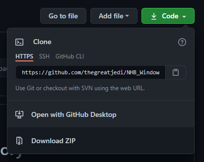
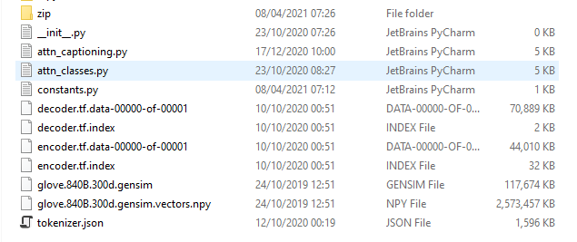

# Windows to History

## Table of Contents
* [Introduction](#introduction)
* [Requirements](#requirements)
* [Installation](#installation)
* [Usage](#usage)

## Introduction
Windows to History is a Capstone Project sponsored by the Singapore
National Heritage Board. It is completed as part of the course
requirements for the Master of Technology in Intelligent Systems
programme by the National University of Singapore Institute of Systems
Science.

In this project, a web application is developed to demonstrate the use
of machine learning techniques to implement image captioning via an
attention-based model and image tagging via object detection. 

This application is built using the following frameworks:
* [FastAPI](https://fastapi.tiangolo.com)
* [React](https://reactjs.org)

## Getting Started
### System Requirements
* Windows 7 or higher (64-bit).
* NVIDIA GPU card supporting CUDA 3.5, 5.0, 6.0, 7.0, 7.5, 8.0 or >8.0
  (Visit the [NVIDIA](https://developer.nvidia.com/cuda-gpus) website
  for a list of CUDA-enabled GPU cards).
* TensorFlow software requirements: Visit the
  [TensorFlow](https://www.tensorflow.org/install/gpu#software_requirements)
  website for a list of other GPU-related requirements and the
  corresponding installation guides.

### Installation
1. Download and install the latest version of 
   [Python 3.8](https://www.python.org/downloads).
2. After installing Python, open the Command Prompt (in Administrator
   Mode if necessary) and install pipenv.
   
       pip install pipenv
3. Clone this repository to your preferred location in the local file
   directory. You can do this using 1 of 2 methods:
   1. Download directly from
      [Github](https://github.com/thegreatjedi/NHB_Windows_to_History)
      in a web browser as a ZIP file, then unzip it.

      
   2. If you have Git installed, you can clone the repository via the
      Command Prompt.
      
          git clone https://github.com/thegreatjedi/NHB_Windows_to_History.git
4. Once downloaded, navigate to the folder location of the downloaded
   repository in the Command Prompt. For example,
      
       cd C:\Programming_Projects\Windows_to_History
5. Once you are in the correct folder location, enter the following
   commands to install the necessary Python packages in an isolated
   virtual environment:
      
       pipenv shell
       pipenv install --ignore-pipfile
   This will install the following key packages and their dependencies:
   * aiofiles
   * async-exit-stack
   * async-generator
   * efficientnet
   * fastapi
   * gensim
   * jinja2
   * nltk
   * pillow
   * python-levenshtein
   * python-multipart
   * spacy
   * sqlalchemy
   * tensorflow
   * uvicorn
6. Enter the following commands to install the TensorFlow
   object-detection package:
   
       cd models\research
       python -m pip install .
7. Enter the following command to install spaCy's pretrained English pipeline
   model:
   
       python -m spacy download en_core_web_lg
8. In your folder explorer, go to
   `<path-to-folder>\Windows_to_History\api\nlp\zip` (example in
   screenshot):
   
9. Unzip the [7zip](https://www.7-zip.org/download.html) archive. You
   should see the following files appear after unzipping completes:
   
10. Move the two unzipped files to
   `<path-to-folder>\Windows_to_History\api\nlp` (example in
   screenshot):
   
   
Installation is now complete. You may proceed to delete the `models` and
`api\nlp\zip` folders and their contents if desired.
   
## Usage
1. In the Command Prompt, navigate to the project directory. For
   example,
      
       cd C:\Programming_Projects\Windows_to_History
2. Enter the following commands to activate the pipenv virtual
   environment and start the server:
   
       pipenv shell
       uvicorn main:app
3. Once the backend server has finished launching, the frontend webpage
   can be accessed via web browser at
   [http://localhost:8000/](http://localhost:8000/)
4. Alternatively, you can configure a specific IP address and network
   port to use. This is required if you wish to access the application
   remotely from a different computer. For example, the following
   command will allow you to access the webpage at
   [http://192.168.119.1:1229/](http://192.168.119.1:1229/)
   
       uvicorn main:app --host 192.168.119.1 --port 1229
5. To shutdown the server, press Ctrl+C in the Command Prompt to end
   program execution.
   
## Contact Us
* Koh Sook Bing - [sookbing13@yahoo.com](mailto:sookbing13@yahoo.com?subject=NHB%20Capstone%20Project)
* Yeo Whye Chung Nelson - [nelsonyeowc@hotmail.com](mailto:nelsonyeowc@hotmail.com?subject=NHB%20Capstone%20Project)

## References
* [Show, Attend and Tell: Neural Image Caption Generation with Visual Attention](https://arxiv.org/pdf/1502.03044.pdf)
* [EfficientDet: Scalable and Efficient Object Detection](https://arxiv.org/pdf/1911.09070.pdf)
* [Flickr Image Captioning : TPU, TF2 & Glove](https://www.kaggle.com/ratthachat/flickr-image-captioning-tpu-tf2-glove)
* [TensorFlow Object Detection API](https://github.com/tensorflow/models/tree/master/research/object_detection)
